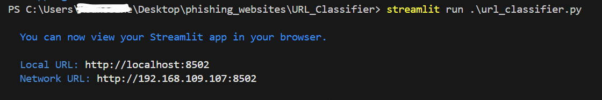

# Introduction :

At its core, this web interface serves as a platform where users can input URLs. Utilizing a machine learning model trained on datasets encompassing both phishing and legitimate URLs, the system predicts the nature of the provided URL. The primary objective of this project is to identify phishing URLs in order to safeguard users from accessing malicious websites or inadvertently clicking on harmful links.

# Installation : 

To download and run the app, follow the instructions below:

1. Clone the repository by executing the following command:

```bash
git clone https://github.com/An-MO72/Phishing-URLs-Detection-using-ML-and-DL.git
```

2. Change the directory to the cloned repository:

```bash
cd Phishing-URLs-Detection-using-ML-and-DL
```

3. To maintain a clean environment and install the required modules, create a virtual environment using Python. For instance, if you're using VSCode, run:

```bash
python -m venv venv
```

4. Activate the virtual environment. The activation process may vary depending on your operating system. I recommend searching online for instructions specific to your system. For example, on Windows, you can activate it with:

```bash
venv\Scripts\activate
```

5. Once the virtual environment is activated, install all the necessary requirements from the `requirements.txt` file:

```bash
pip install -r requirements.txt
```

6. After the download is complete, you're ready to run the application. Execute the following command:

```bash
streamlit run url_classifier.py
```

7. Upon successful execution, the application will run on localhost port `8502`. You will see an output indicating that the application is running.




# Call for Contributors:

While this project effectively classifies URLs as phishing or malicious, it still faces limitations, particularly in terms of features. I believe there's ample room for improvement in our feature extraction process to enhance reliability and accuracy, mitigating issues related to network errors and URL length. One prominent challenge is our handling of short URLs; for instance, a legitimate URL like https://www.facebook.com might erroneously be classified as malicious due to the predominance of longer URLs in our training data.

Addressing this limitation requires collaborative effort. I'm enthusiastic about working together to refine our approach and ensure robust URL classification. If you're interested in contributing and helping us overcome these challenges, let's connect! You can reach out to me via [LinkedIn](https://www.linkedin.com/in/mouhssine-annouri/). Your insights and expertise will be invaluable in advancing this project. Let's make it even better together!